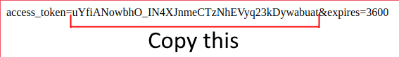
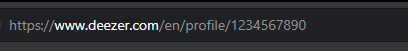

# DeezerRP
This BetterDiscord plugin retrieves your last played track on Deezer and shows it on your Discord profile as a Rich Presence.

  

Unfortunately due to Deezer's (kinda bad)) API, you can only see the last track you listened to, not the current one. (TLDR: The RP will be late by one song)

## Features
* Show what songs you're listening with Deezer on Discord.
* Show a Listen Along button so anyone can listen to your song too!
* The plugin hides itself if it detects Spotify or another Activity (can be configured individually in settings).
* Other customizations such as: Using Listening instead of Playing as status, show the album cover or show the artist's name as your activity's name.
* An easy (but honestly kinda long) setup. But once it's done, it's done forever!

## Installation
* First, download the plugin by clicking [here](https://raw.githubusercontent.com/ImNotStealth/DeezerRP/master/DeezerRP.plugin.js) and put it in BetterDiscord plugin folder.  
* Go to [Deezer's MyApps](https://developers.deezer.com/myapps) and create a new application.
* For the sake of simplicity (You can change this if you want obviously), name your application "Discord Rich Presence" and input *https://google.com/* as your "Application Domain", your "Redirect URL after authentication" and your "Link to your Terms of Use".

* Now let's configure the plugin!
* Input your App ID, Redirect URI and App Secret in the plugin's settings.
* Click the link below to login with your Deezer account (since you made your own Application, none of your information will be shared with others).
* Once you logged in you will be redirected to your "Redirect URL" and it will now have a code in the URL, copy it and paste it in your plugin's settings

* Next, do the same thing for your access token (click and link and copy the token and paste it in your plugin's settings)

* Finally your User ID, go to *https://deezer.com/* and click on your profile. You will see in the URL 10 digits, copy those and paste them in your settings and you're done!

  

## Troubleshoot
* If after a minute or two, you don't see the RP. Check in your Discord settings that you're showing your activities (The setting can be found in Settings -> Activity Privacy -> Display current activity as a status message.)

* Check at the top of your Discord window if the plugin isn't saying that there's an error. If you have one it should look like this and you should check your settings in case you missed a step.

* Obviously if you have any issues, make an issue or a pull request and I'll try to look into it!
